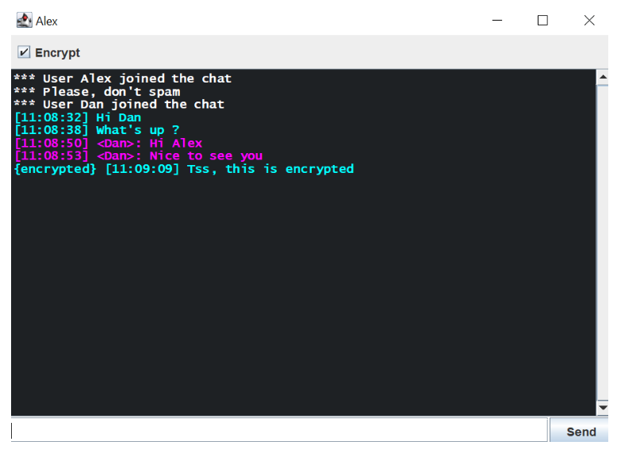
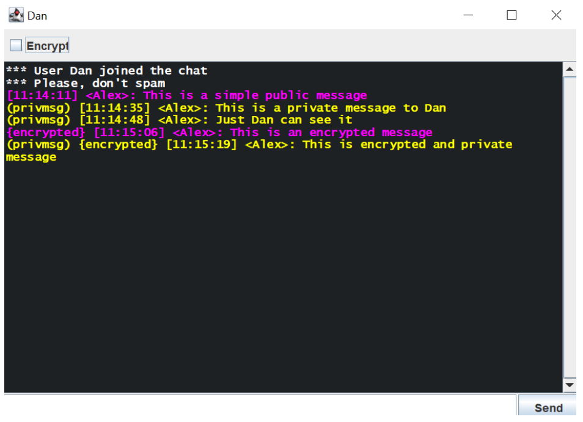
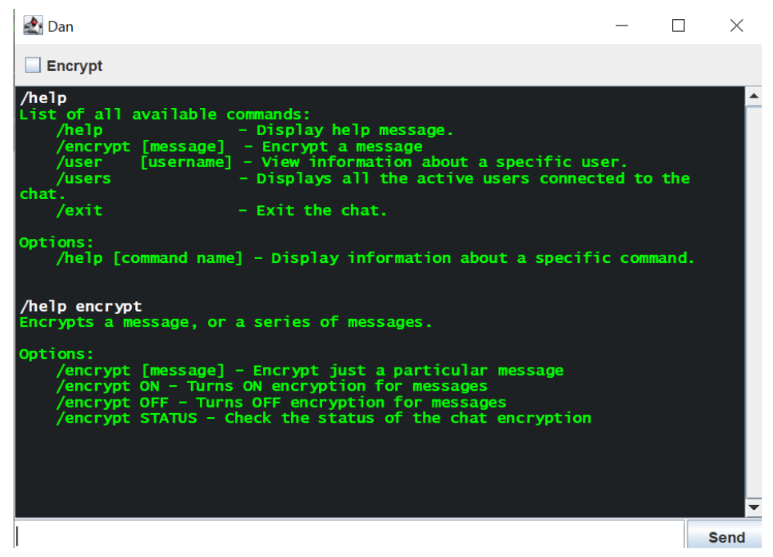
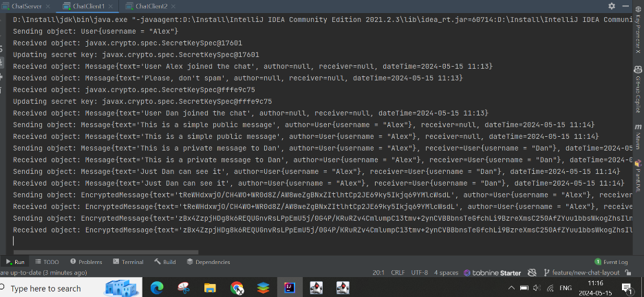

# Secure Chat Application 🔐

This project is a secure chat application developed in Java using sockets for network communication. The application supports both public and private messaging and includes features for encrypted communication using asymmetric encryption.

## Features 🏆

- **Public and Private Messaging**: Users can send messages to everyone in the chat or privately to specific users.
- **Encryption**: Messages can be encrypted using RSA, ensuring secure communication between users.
- **Commands**: Users can use different commands both locally and remotely.
- **Graphical User Interface**: A simple and intuitive GUI built with Swing for user interaction.
- **Server-Client Architecture**: The application uses a multi-threaded server to handle multiple client connections simultaneously.


## How to Run 🛠

1. **Clone the Repository**:
    ```sh
    git clone https://github.com/Alexenon/client-server-chat-with-sockets.git
    ```

2. **Open the Project**: Open the project in your favorite Java IDE (e.g., IntelliJ IDEA, Eclipse).

3. **Run the Server**:
    - Navigate to the `chat` package.
    - Run the `ChatServer` class to start the server.

4. **Start Clients**:
    - Navigate to the `chat` package.
    - Run the `ChatClient1` class to start first client.
    - Run the `ChatClient2` class to start second client.
    - Enter a unique username when prompted.

5. **Send Messages**:
    - Type your message in the message field.
    - To send a private message, use the format `username: message`.
    - To send a public message, simply type the message and send.
    - To type command, search firstly for all available commands using command `/help` then apply required command. 
    - To enable encryption, check the "Encrypt" checkbox before sending your message.

## Dependencies 🔗

- Java 11 or higher

## Future Enhancements 🏹

- **User Authentication**: Implement a proper user authentication mechanism.
- **Improved UI**: Enhance the user interface for better user experience.
- **Telnet / SSH** Add posibility to use the chat, without UI but directly using telnet or ssh.


## Screenshots 🖥

#### Simple messaging

#### Different types of messages

#### Commands

#### Logs from a client



## Components 🛡

- **Client**: Handles user input, connects to the server, sends messages, and receives and displays incoming messages.
- **Server**: Manages client connections, broadcasts messages to all users, and handles private messaging and encryption.
- **Encryption**: Utilizes RSA for encrypting and decrypting messages, ensuring that only the intended recipient can read the message.


## Contributing ❤

Feel free to contribute to this project by submitting issues or pull requests. Please ensure that your contributions adhere to the project's coding standards and include appropriate tests.

## License ✏

This project is licensed under the MIT License. See the [LICENSE](LICENSE) file for details.

---

Happy secured chatting! 👩‍💻


